# **Scratch Game Steps**

## Layout

## **Step 1**

- Open a blank scratch

## **Step 2**

- Chose a sprite for the catcher, and one for the dropping object. In total should have 2. 
    - Note: Background is optional but you can choose whatever you think fits.

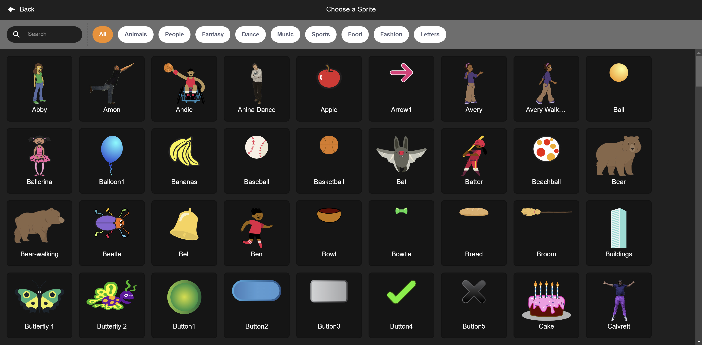
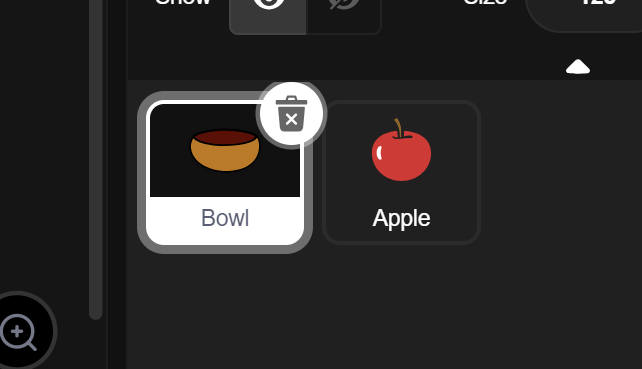

## Code

## **Step 3**

- Go to the code console.
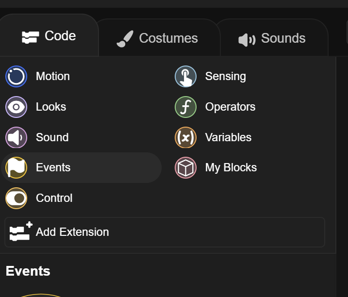

- On the sprite you chose for the catcher, add a Flag event and a forever loop. Like shown below.
 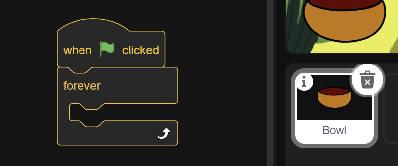

 ## **Step 4**

 - Inside the forever loop, add 2 if-then statements.
 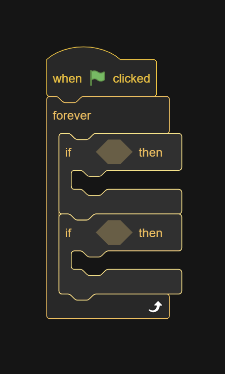

## **Step 5**

- In the empty space, add a key press sensor for the respective arrow keys. Then inside the statements add a **change x by __** action. the left should move negative, the right should move positive
    - note: the larger the number, the faster it'll move. The smaller, the slower.

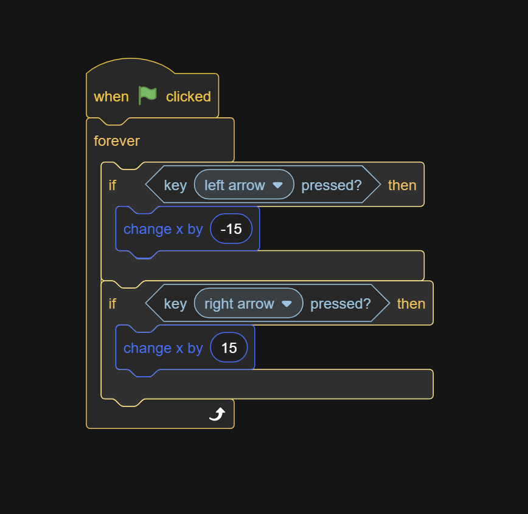

## **Step 6**

- Go to *variables* and create a variable **FOR ALL SPRITES**
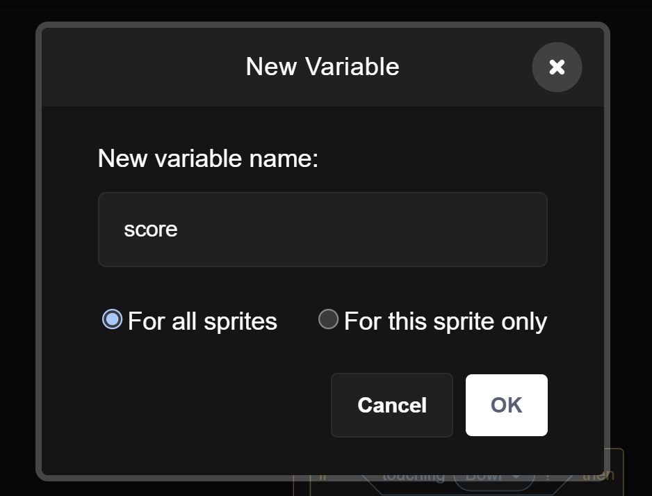

## **Step 7**

- In the sprite you chose for the falling object, add a flag event. Set the score variable to 0 and add a forever loop.

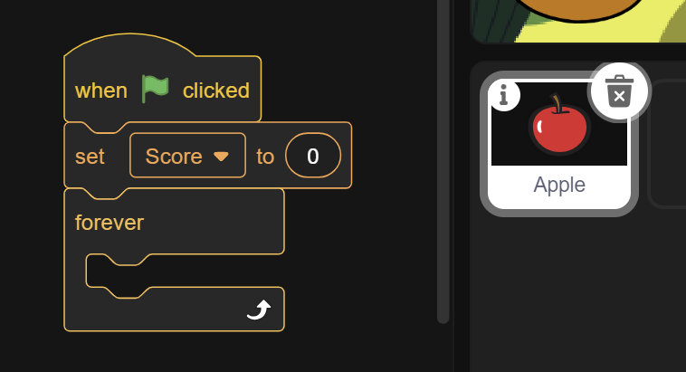

## **Step 8**

- Inside the forever loop, add a **change y by __** action and choose the speed ***should be negative***, the lower the number, the faster the speed. After that, add 2 if block, inside the forever loop as well.
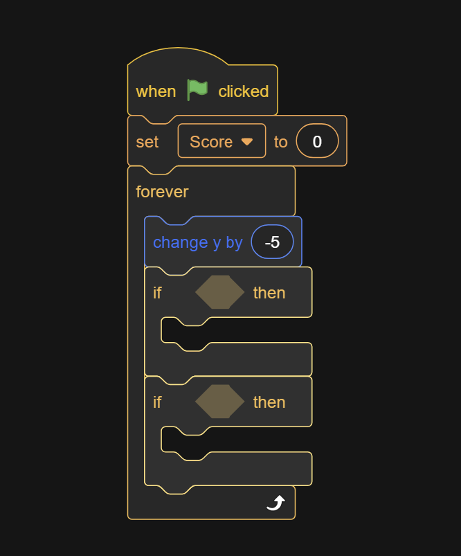

## **Step 9**

- In the empty space, add a **touching __** sensor, and set it to the catcher sprite. Then inside the statement change the score counter by 1.

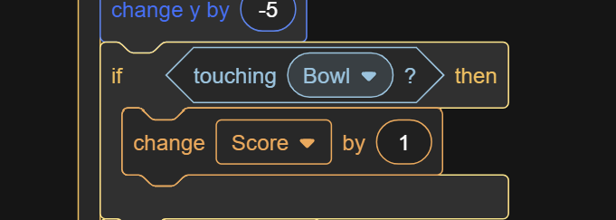

## **Step 10**

- Under the change score, add a **go to random position** action, and a **set y to __** action.
    - Note: works better if the value is higher than 180.

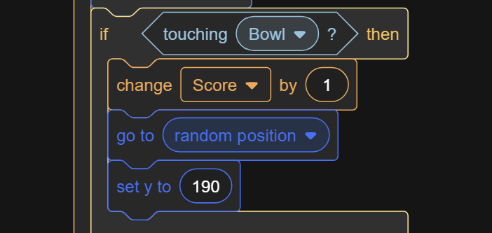

## **Step 11**

- In the second if block, make a **<** operator for the **y position** to be less than -180/-190. Place that in the empty space.
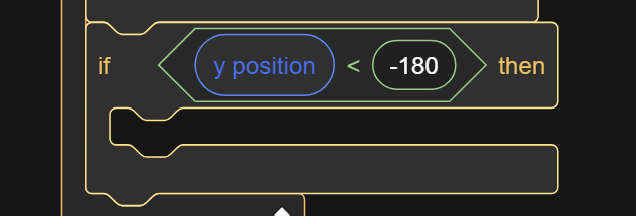

## **Step 12**

- Inside the statement add the same logic as **Step 10**

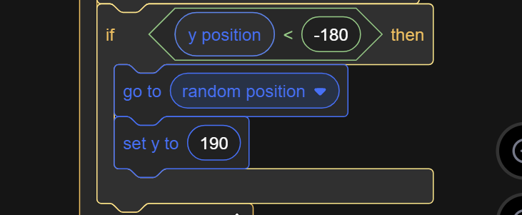

## **Extra**

## **Rotating**

### **Step 1**

- In the sprite you chose for the falling object, add a flag event and a forever loop

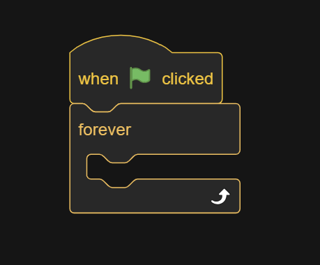

### **Step 2**

- Inside the loop, put a rotate to either left or right action and add a value to whatever you'd like (the larger, the faster it'll rotate.)

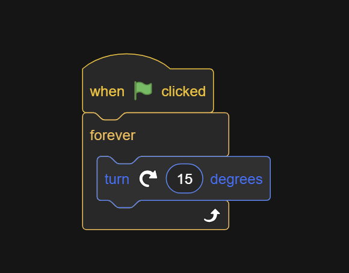